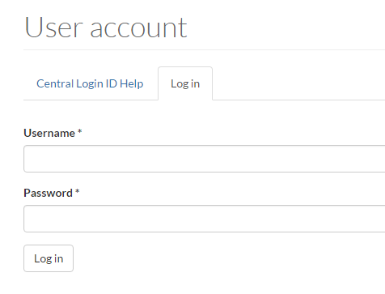
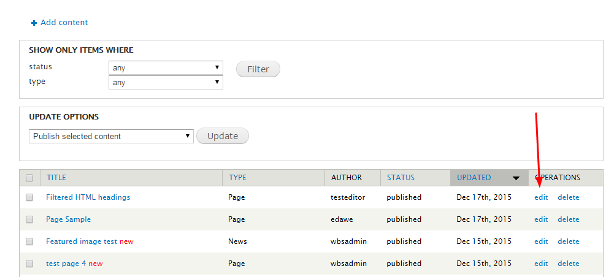

# Basic Beginner Functions

## Howto Perform Administration and Content Tasks
To add any type of pre-defined content, the methods are the same. When Logged in as a Site Manager or Content Creator the first bar at the top of the page is called the **Administration Menu Bar** and it allows users with the correct permissions to add/view/delete/edit content as well as other administration specific tasks.

## Users
### How-to Login/Logout
1. Navigate to your website: www.uoguelph.ca/*sitename*

2. To `login` use your Central Login ID and Password in the user login fields.
3. To `logout` select or click the `logout` option located on the menu bar.

### Adding Users
Request that new users attempt to login to the site - this provides their Username (which is their Central Login-ID for U of G staff).

1. At the top of the **Administration Menu Bar** select `People`.
2. Either use the filter or scroll down to find the Username.
3. Select appropriate Username.
4. Select `Role` (i.e. editor).
5. Enter a *random* password information (It will not be retained since the Central Login ID and Password will override and provide access to the website).
6. Select `Save`.

*Note: If you already know the Central Login-ID and email address, or the user is not U of G authenticated, accounts can be set-up without having the user attempt the initial login.*

## Finding and Editing Content
All content created on your website can be viewed by selecting the `Find Content` shortcut located on the Administration Menu shortcut bar, or by selecting `Content` on the Administration Menu bar itself.

To Edit content you can search using the filter drop-down menus for a particular content type and then select `edit` for that particular item.

saman is typing
