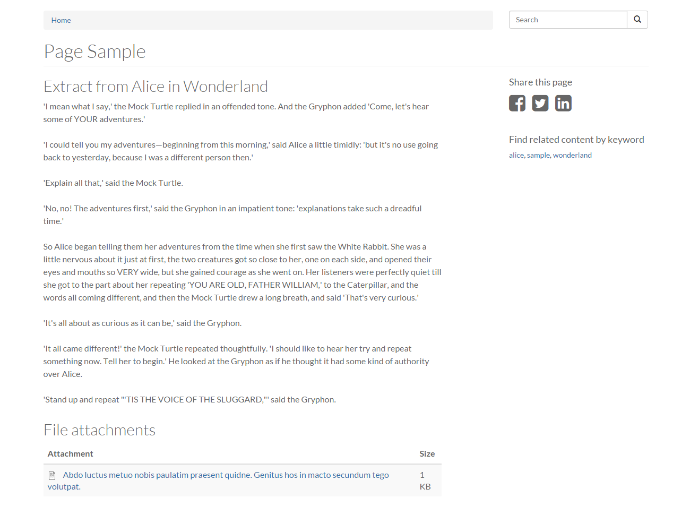
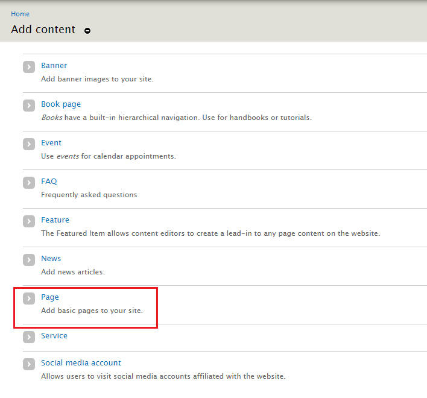
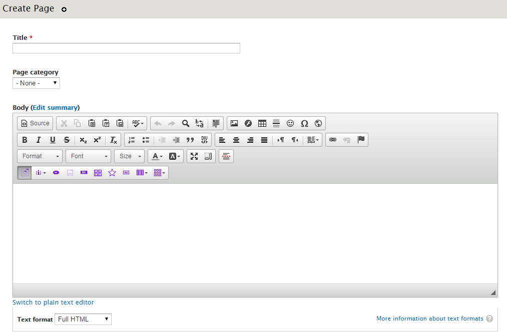
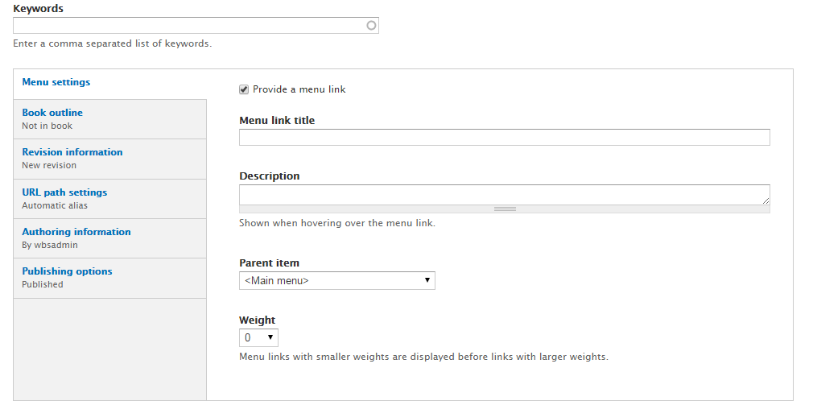

# To Add a Basic Web Page
The *Basic page* content type are used for static content that can (but are not required to) be linked into the main navigation bar. This is one of the most "basic" content types and can be very flexible.

## Creating a Basic Page
1. On the Administration bar, select `Add Content`.

2. Select `Page`.

3. Enter a **Title**.
4. If you have [page categories](../taxonomies.md#categories) defined select the appropriate one.
5. In the **body field** enter what you want displayed on your web page. Follow this link [for more information on how to use the WYSIWYG editor](../wysiwyg-editor.md).

6. If you want to add any files to download attach them using the **File Attachment** option.

7. If you want this web page to be accessed through your menus check the `provide a menu link`.
    1. Enter an appropriate **Title** and **Description**.
    2. In the `Parent item` drop down menu select which menu heading you want the new link to be accessed through. *Example: Ff it is an event select event to have it as a sublink there.*

8. If you have the proper authority to publish right away, select `Published` in `Publishing options`.
9. Select `Save` when you are done.

