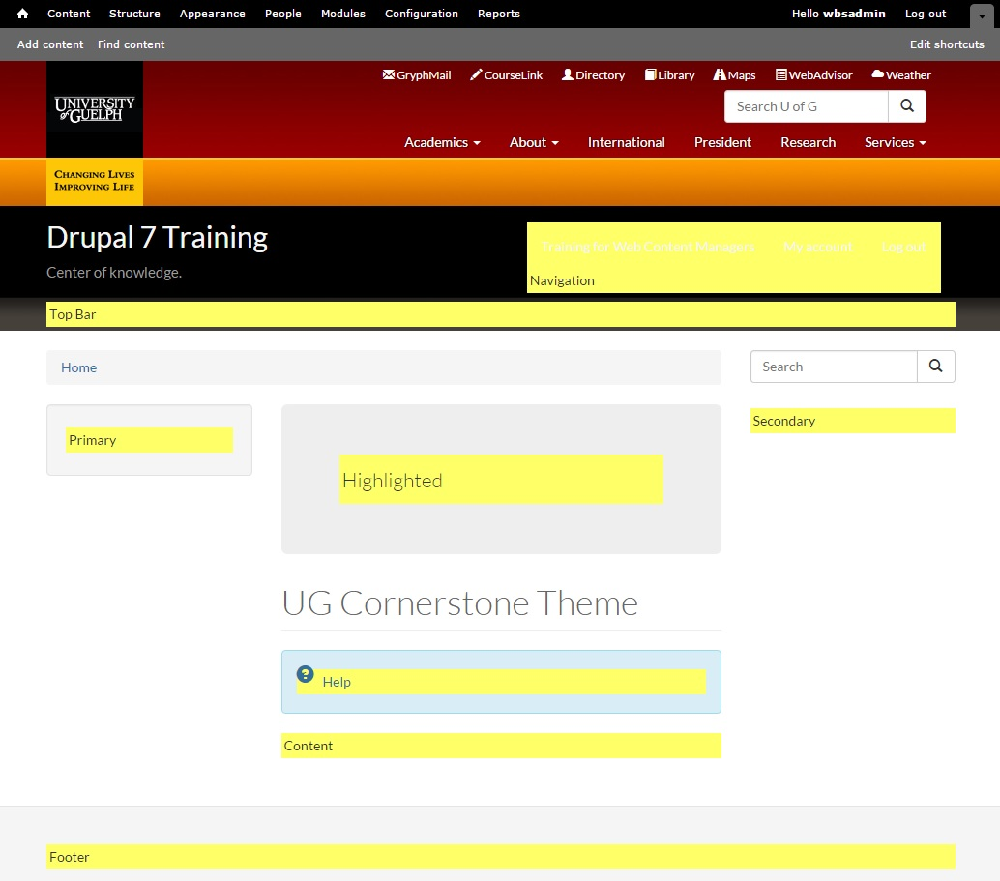

# Guide to The University of Guelph's Drupal Web Content Management System and Template
Please begin by reading the following:
## Conventions Used In This Documentation
*Emphasis* or *Italic*
* Used for pathnames, filenames, program names, new terms where they are defined, and web addresses.

**Strong** or __Bold__
* Used for options, titles.

`Constant Width`
* For things the user will see and read on the screen.

# What is Drupal?
## A Brief Description
Websites are often thought as a collection of static pages, perhaps with some functions like a blog or a comments section. When they go to manage their site, they are thinking in terms of a tree-like hierarchy of pages that they will edit.

**The University of Guelph Business Web Solutions** department uses a *Content Management System (CMS)* called *Drupal*. *Drupal* on the other hand, treats most content types as variations on the same concept: a *Node* (more on this in a moment). Static pages, blog posts, and news items (some possible node types) are all stored in the same way, and the site's navigation structure is designed separately by editing menus, views (lists of content), and blocks (side content which often have links to different site sections).

## The Flexibility Of Nodes
 Essentially, a *node* is a set of related bits of information. When you create a new blog post, you are not only defining its body text, but also its title, content, author link, creation date, taxonomy (tags), etc. Some of these elements will be shown by the theme layer when the node is displayed. Others are meta-data that control when the node will show up at all - such as taxonomy or publishing status.

## Regions and Blocks

Pages on your *Drupal* site are laid out in Regions. These can include the header, footer, sidebars, and main content regions. Your theme may define additional regions.

Blocks are discrete chunks of information that are displayed in the regions of your site's pages. Blocks can take the form of static chunks of HTML or text, menus (which are for site navigation), the output from modules (e.g. hot forum topics), or dynamic listings that you've created yourself (e.g. a list of upcoming events).

## About AODA and Content Editing Standards.
**AODA Standards** – effective January 2014 website content changes must comply with provincial legislation known as the **Accessibility for Ontarians with Disabilities Act (AODA)**. The Standards governing websites is called the **Web Content Accessibility Guidelines (WCAG) 2.0** *Level A* compliance was required in 2014 and *Level AA* compliance is required by 2021. Recommendations that will assist content editors in maintaining these standards are identified and outlined in this user manual as well as in the following list:
* Ensure all images added to your site have *descriptive* Alt tags no less than 100 characters. In the event of a purely decorative image no Alt text needs to be added.
* [U of G Web Accessibility site](https://www.uoguelph.ca/accessibility/web/).
* [The Siteimprove website application](http://siteimprove.com/) is used for tracking technical compliance - for user training **Contact Diversity & Human Rights**.
* *Required fields*: Fields flagged as required must be completed for AODA compliance.

# Basic Beginner Functions For Drupal 7
## How-to Perform Administration and Content Tasks
To add any type of pre-defined content, the methods are the same. When Logged in as a Site Manager or Content Creator the first bar at the top of the page is called the **Administration Menu Bar** and it allows users with the correct permissions to add/view/delete/edit content as well as other administration specific tasks.

## Users
### How-to Login/Logout
1. Navigate to your website: www.uoguelph.ca/*sitename*
2. To `login` use your Central Login ID and Password in the user login fields.
3. To `logout` select or click the `logout` option located on the menu bar.

### Adding Users
Request that new users attempt to login to the site - this provides their Username (which is their Central Login-ID for U of G staff).

1. At the top of the **Administration Menu Bar** select `People`.
2. Either use the filter or scroll down to find the Username.
3. Select appropriate Username.
4. Select `Role` (i.e. editor).
5. Enter a *random* password information (It will not be retained since the Central Login ID and Password will override and provide access to the website).
6. Select `Save`.

*Note: If you already know the Central Login-ID and email address, or the user is not U of G authenticated, accounts can be set-up without having the user attempt the initial login.*

## Links to other pages on how to create specific content:
* [Learn more about UoG Drupal features](Drupal_Features_Terms_Acroynms.md)
* [How to create a Basic Page](features/howto-page.md)
* [How to create a Featured Item](features/howto-featured.md)
* [How to create a Banner](features/howto-banner.md)
* [How to create a News Item](features/howto-news.md)
* [How to create an Events listing](features/howto-events.md)
* [Social Media](features/howto-socialmedia.md)
* [How to create a Service page](features/howto-services.md)
* [How to create a FAQ](features/howto-FAQ.md)
* [How to create a Book](features/howto-book.md)
* [How to create People Profiles](features/howto-profiles.md)
* [How to create a Blog](features/howto-blog.md)
* [How to create a Web Form](features/howto-webforms.md)
* [Creating a Landing Page](features/howto-landingpag.md)
* [How to create a Special Alert](features/howto-specialalert.md)
* [How to create Course Outlines](features/howto-courseoutlines.md)
* [How to create Custom Content](features/howto-customcon.md)
