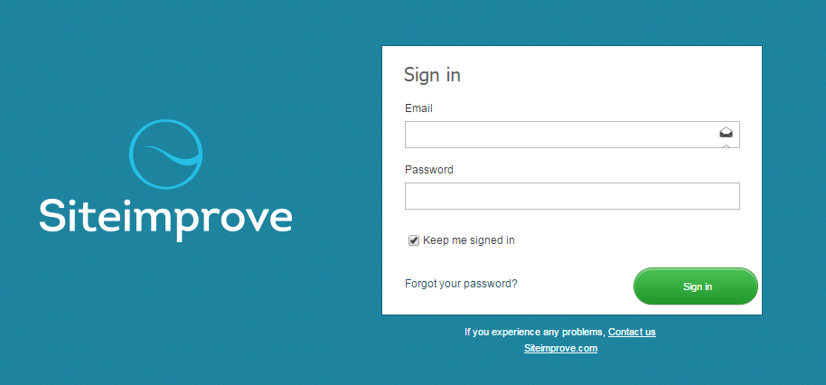
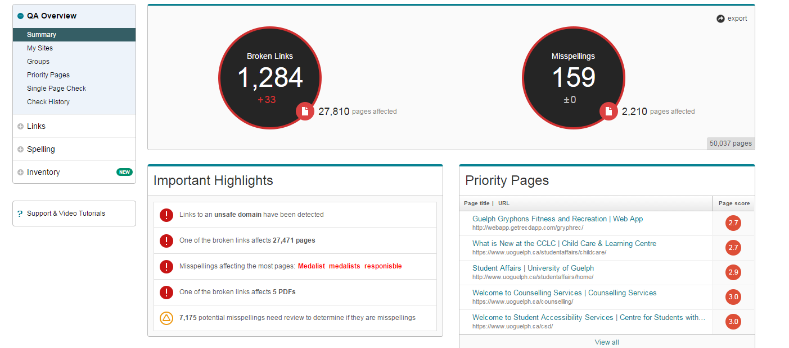
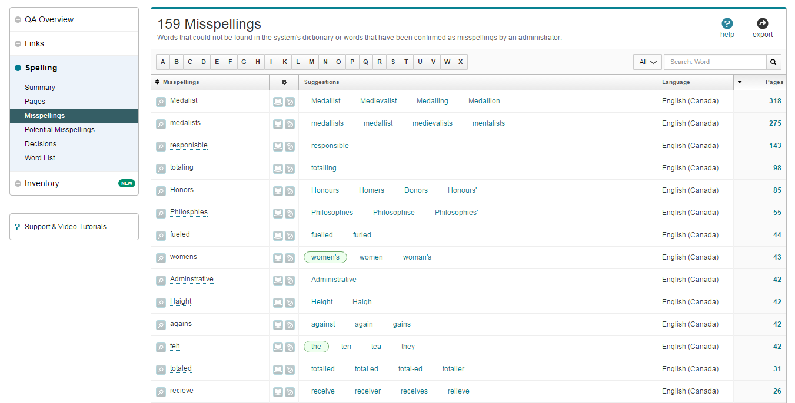
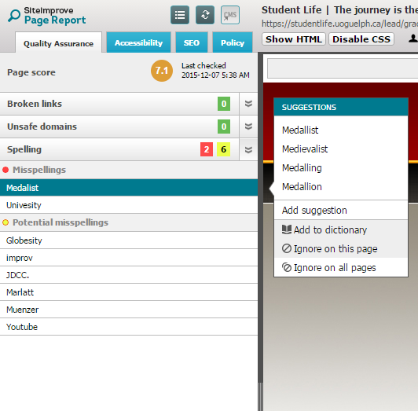

# Guide to SiteImprove Quality Assurance
## What is SiteImprove Quality Assurance?
* SiteImprove is a service that regularly crawls your organizational website and tracks any broken links, spelling errors, and accessibility issues.
* Fixing any spelling or link errors reported by SiteImprove requires the user to edit a page within the University of Guelph's content management system, Drupal 7.
* SiteImprove does NOT affect or edit pages within any site.
* Users can [login to the SiteImprove](http://my.siteimprove.com/) to view detailed information about their departments site.
* SiteImprove can email users every five (5) days with a report on a site.
* Users who maintain multiple sites can view a report on each of those specific sites by selecting the appropriate Group from the dropdown menu at the top of the dashboard titled (ADD TITLE).
* SiteImprove does rank pages on the number of errors based on a scale of 0-10 (10 is best).

## Getting Access to SiteImprove
If you are a web content owner, you should have already received your SiteImprove credentials. If not, [contact Diversity & Human Rights](http://www.uoguelph.ca/diversity-human-rights/) and they can add you to the list and give you access to the system for your content site area.

## Logging In To SiteImprove
Once you have been set you up as a user, you will receive an email prompting you to set a password for your account. Once that is done, you can [login to the SiteImprove system](http://my.siteimprove.com).

## Introduction to SiteImprove Quality Assurance
Once inside SiteImprove, you will have access to a customized dashboard reflecting the report of your specific site. If you maintain or have access to multiple sites, those sites are listed under the Group drop down menu.

SiteImprove Quality Assurance is composed of four modules:
* QA Overview – provides an overall view of a sites health, highlighting broken links and misspellings that affect the most pages.
* Links – specific details concerning pages with broken links such as frequent broken links, external links, etc.
* Spelling – specific details concerning the misspellings located across your site.
* Inventory – provides information regarding quantity and types of documents available on your site along with information regarding phone numbers, email addresses, media, etc.

SiteImprove Quality Assurance also comes bundled with an Accessibility tab for viewing your site’s compliance to WCAG 2.0 standards.
Please note that SiteImprove Quality Assurance reports are based on the most recent site scan and may not reflect any recently published changes. You can initiate a rescan of any page at any time by clicking the button labed`rescan`.

**Example SiteImprove Quality Assurance dashboard:**

## Correcting Spelling Mistakes
* In order to look at spelling mistakes specifically, you can click on the number within the Misspellings button within the dashboard. You can also access the misspelling page using the navigation menu, under spelling.
* This will take you to a page which lists all the misspellings on this section of the website.

* To see which page a particular spelling mistake is on, you can click on the magnifying glass.

* This will then open a new tab and take you to a page highlighting your spelling mistakes within the body text in red. Misspellings and Potential Misspellings are listed on the menu to the left.

### Potential Misspellings
Potential misspellings are words that SiteImprove does not recognize, and will need review. To review a potential misspelling do the following:
1. Click on it and a menu will open with suggestions and other options.
2. You can either confirm the misspelling - in which case it becomes highlighted in red and registered as a misspelling on the `Quality Assurance` pane - Ignore it (in the case of foreign language words) or add it to the dictionary - in which case the potential misspelling will disappear and any other instances of this word will stop being registered as potential misspellings.

### Fixing Misspellings
* In order to fix a misspelling, you will need to log into your website and navigate to the page where the misspelling is located and fix it manually.
* After you have made the necessary change, you can go back to the page within SiteImprove and click on the `Recheck Page` button in the top left of the page.

## Fixing a Broken Link
1. Log in as usual and pick your site to get to the overview page, and then click on the number within the “Broken Links” circle.

2. The next page outlines all of the broken links in your site. Take note of the column to the right of this called “pages”. This tells you on how many pages this particular link is found (and broken) on.
3. In order to see which pages a link is broken on, you can hover over the box with the number of pages in it and a “+” will appear. Click this to expand the box and list all of the pages in which this broken link can be found.

4. Clicking on one of the results will then open a page report in a new tab and show you where on the page the broken link is.
5. You will need to log into your Drupal Website and fix the broken link in the editor. Then, when the link is fixed you can click the `recheck` button/option the page and update Siteimprove.

*Note: it can take a few minutes for the tool to reflect the amended link. The link will then be removed in time for the next report.*

## Fixing Accessibility Issues

Notes:

http://www.du.edu/uts/webwork/siteimprove-reports/SiteImprove.pdf
https://portal.uea.ac.uk/documents/6207125/6490101/Siteimprove%2BQuick%2BStart%2BGuide.pdf/c8554f51-5f5b-4272-b81d-714db6bf80a5
