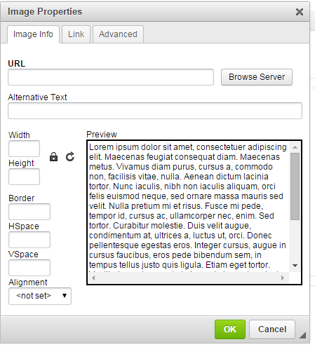
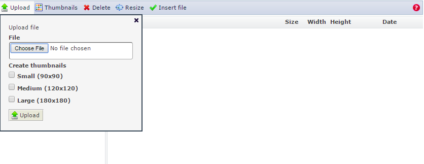

#  WYSIWYG Editor
The content editor has a collection of tools located at the top of the main Body/Description, useful to edit and customize format of the contents. *WYSIWYG* stands for What You See Is What You Get.

## Adding Images Within the Body Section
1. Goto the **Body** section of the page.
2. From the WYSIWYG Editor click on the image icon.

3. And then click `Browse Server`.

4. If image isn't already uploaded to your filesystem select upload from the menu bar.

4. Select your desired image and then click .
5. Unless the image is decorative it is **mandatory** to add Alternative Text.
6. `Width`, `Height` and `Border` settings should be blank.
7. Select OK and your image should be inserted.

## Adding Tables
The **WCAG 2.0** standard for table settings dictates that table markup must be properly structured to differentiate and properly link between header and data cells.

1. Click on Table icon in the WYSIWYG editor.
2. Enter the number of columns and rows.
3. Add a `Caption` if a title is not provided elsewhere.
4. Adding a `Summary` is optional but recommended if the table is complicated and information not provided elsewhere for screen readers.
5. Hit `OK` and begin entering your data.

*Note: To modify an existing table right-click on a cell in the table and additional options will be displayed.*

## Adding a Link
The **WCAG 2.0** standard for links dictates that the purpose of each link can be determined by the link text alone.

*Example* Do not use:
>To search the internet click [here](www.google.ca).

Use this format instead:
>[Visit Google's webpage](www.google.ca).

To do this in the **body** section:

1. Highlight the text to use for the link.
`show image of highlighted text`
2. Click on the Link icon (in the Editor).
`insert image of link icon`
3. Insert the URL that you want to link to:
    1. External links - use a link copied from the browser *i.e. www.uoguelph.ca*.
    2. Internal links - use the page name copied from the browser *psychology/faq-page* and ensure the protocol is selected to < other >

For more details, refer to the quick reference [How to Meet WCAG 2.0.](http://www.w3.org/WAI/WCAG20/quickref/)
